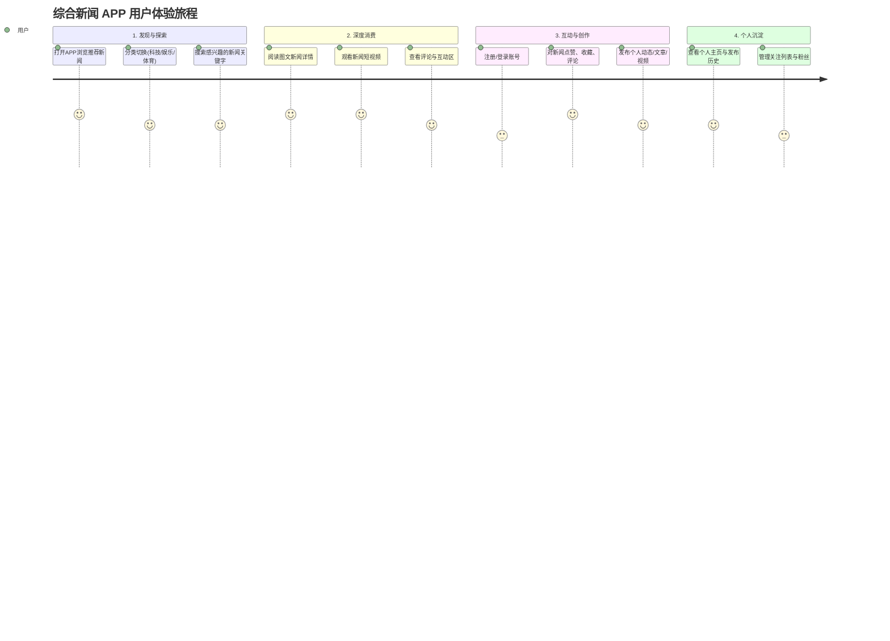
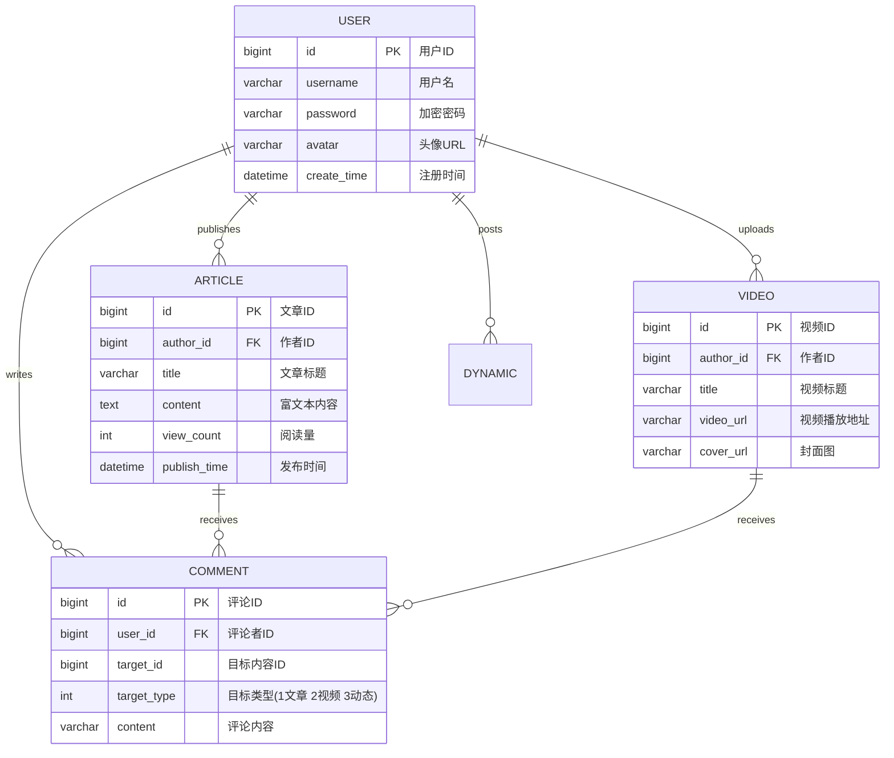

# 综合新闻 APP - 项目说明文档

## 1. 项目背景
随着移动互联网的普及，用户获取资讯的方式已从传统的纸媒、PC端全面转向移动端。现代用户不仅需要被动地获取海量、实时的新闻资讯，更渴望参与到内容的创造与互动中。本项目旨在设计并实现一个“综合新闻 APP”，不仅提供图文、视频等多媒体新闻的浏览与检索服务，还打造一个UGC（用户生成内容）社区，允许用户自由发布文章、视频与动态，形成一个兼具媒体属性与社交属性的综合信息平台。该项目作为毕业设计，将全面覆盖移动端应用的前后端完整开发生命周期。

---

## 2. 用户旅程 (User Journey)

以下是典型用户在综合新闻 APP 中的核心交互旅程：



---

## 3. 需求描述与功能清单

基于毕业设计任务要求，本系统的核心功能模块规划如下：

### 3.1 用户端核心功能
| 模块分类 | 功能点 | 描述说明 |
| :--- | :--- | :--- |
| **内容浏览** | 图文新闻 | 支持图文排版、无限下拉加载、分类导航（头条、科技、娱乐等） |
| | 视频播放 | 支持短视频/长视频播放、全屏切换、播放进度控制 |
| | 详情页 | 展示正文内容、发布时间、作者信息、阅读量、相关推荐 |
| **搜索系统** | 关键词检索 | 支持对文章、视频、动态进行全局模糊搜索 |
| | 历史/热搜 | 记录用户搜索历史，展示当前平台热搜词条 |
| **内容发布** | 发布文章 | 富文本编辑器支持，可上传封面与多张配图 |
| | 发布视频 | 支持视频文件上传、封面截取、填写视频描述 |
| | 发布动态 | 类似微博/朋友圈的轻量级图文动态发布 |
| **互动社交** | 转赞评收 | 对任意内容进行点赞、评论、收藏、分享操作 |
| | 关注系统 | 关注感兴趣的创作者，拥有独立的“关注”信息流 |
| **用户中心** | 账号管理 | 注册、登录（支持手机号/密码）、个人资料修改、头像上传 |
| | 创作中心 | 管理自己发布的文章、视频和动态，查看互动数据 |

---

## 4. 技术架构设计

结合最佳实践，本项目采用**前后端分离**架构。前端采用适合多端打包的 `UniApp`，后端采用高并发、非阻塞 I/O 优势显著的 `Node.js` 架构，非常适合资讯类、UGC 类高频读写的业务场景。

### 4.1 前端技术架构
*   **核心框架**: `UniApp` + `Vue 3`（支持编译为 H5、微信小程序及 App）
*   **状态管理**: `Pinia` 或 `Vuex`（负责全局状态如用户登录凭证、购物车/未读消息数）
*   **UI 组件库**: `uView UI` / `ColorUI`（提供丰富的基础组件，加速移动端开发）
*   **网络请求**: 封装 `uni.request`，统一处理 Token 注入与全局错误拦截。

### 4.2 后端技术架构
*   **核心框架**: `Node.js` + `Express` / `Koa` / `NestJS`（推荐使用 TypeScript + NestJS，提供强类型与依赖注入支持）
*   **持久层框架**: `Prisma` / `Sequelize` / `TypeORM`（ORM 框架，简化数据库操作）
*   **数据库**: `MySQL 8.0`（关系型数据存储）或 `MongoDB`（非关系型，更适合灵活的文档型数据）
*   **缓存中间件**: `Redis`（存储短信验证码、热点新闻缓存、高频点赞数据）
*   **对象存储**: `阿里云 OSS` 或 `MinIO`（用于存储图片、视频等富媒体资源）

### 4.3 架构示意图

```mermaid
graph TB
    subgraph 前端展示层 (UniApp)
        A1[iOS/Android APP]
        A2[H5 移动端]
        A3[微信小程序]
    end

    subgraph 接入层
        B[Nginx / API 网关]
    end

    subgraph 业务逻辑层 (Node.js)
        C1[用户服务]
        C2[内容服务<br/>文章/视频]
        C3[互动服务<br/>评论/点赞]
        C4[搜索服务]
    end

    subgraph 数据存储层
        D1[(MySQL / MongoDB)]
        D2[(Redis缓存)]
        D3[OSS 文件存储]
    end

    A1 --> B
    A2 --> B
    A3 --> B
    B --> C1
    B --> C2
    B --> C3
    B --> C4
    C1 --> D1
    C2 --> D1
    C2 --> D3
    C3 --> D1
    C3 --> D2
    C4 --> D1
```

---

## 5. 前端页面规划

| 页面名称 | 路由路径 | 核心组件与逻辑 |
| :--- | :--- | :--- |
| **首页** | `/pages/index/index` | 顶部 TabBar（分类切换），Swiper 轮播图，瀑布流新闻列表 |
| **视频页** | `/pages/video/index` | 沉浸式视频列表，`video` 标签封装，播放状态控制 |
| **发布页** | `/pages/publish/index` | 分类选择器（动态/文章/视频），媒体上传组件，表单校验 |
| **搜索页** | `/pages/search/index` | 搜索输入框，历史记录 Tag，搜索结果 Tab 列表 |
| **详情页** | `/pages/detail/article` | `rich-text` 富文本解析，吸底评论输入框，相关推荐列表 |
| **我的页** | `/pages/user/profile` | 用户信息面板，数据统计栏，功能宫格（我的收藏、我的发布等） |

---

## 6. 后端接口规划 (RESTful API)

所有接口统一采用 `/api/v1/` 前缀，使用 JSON 格式进行数据交互。

### 6.1 统一响应结构
```json
{
  "code": 200,          // 状态码：200成功，401未授权，500服务器错误
  "msg": "操作成功",     // 提示信息
  "data": { ... }       // 具体的业务数据结构
}
```

### 6.2 核心接口清单
*   `POST /api/v1/user/login` - 用户登录/注册
*   `GET /api/v1/news/list` - 获取新闻列表（参数：`categoryId`, `page`, `size`）
*   `GET /api/v1/news/{id}` - 获取新闻详情
*   `POST /api/v1/content/publish` - 发布内容（文章/视频/动态）
*   `POST /api/v1/interaction/like` - 点赞/取消点赞
*   `GET /api/v1/search` - 全局搜索接口

---

## 7. 数据库设计 (ER 图)

以下为核心业务实体的关系与表结构设计：



---

## 8. 前后端联调与开发规范

为保证工程质量与可维护性，前后端开发需严格遵守以下规范（特别是前端控制台规范）：

### 8.1 联调规范
1.  **接口契约**: 联调前需先在 ApiFox/YApi 输出接口文档，后端先行提供 Mock 数据。
2.  **鉴权机制**: 采用 `JWT (JSON Web Token)`。前端在登录后将 Token 存入本地，后续所有拦截器自动在 Header 追加 `Authorization: Bearer <token>`。
3.  **异常处理**: 后端提供统一的全局异常拦截器（`@ExceptionHandler`），前端提供统一的网络请求错误拦截（如 401 自动跳转登录页）。

### 8.2 代码注释与 Console 输出规范（严格执行）
根据项目管理规范，前端代码需遵循以下强制规则：

*   **注释规范**:
    *   **必须写注释**：复杂的业务判断、非直观的逻辑、核心主流程（如鉴权、发布流程参数处理）。
    *   **禁止写注释**：显而易见的代码（如 `let count = 0`）。
    *   **方法级注释**：需标明 `@param` 和 `@returns`。
*   **Console 打印规范**:
    *   **禁止使用** `console.log`，必须使用明确等级的 `console.info`, `console.warn`, `console.error`。
    *   **严禁输出**：用户隐私数据、Token、完整的接口响应体。
    *   **环境控制**：生产环境下仅允许保留必要的 `console.error`。
    
**规范代码示例：**
```javascript
/**
 * 提交发布内容
 * @param {Object} payload 包含标题、内容、类型的载荷
 * @returns {Promise<void>}
 */
async submitContent(payload) {
    // 校验必填项，防止空内容提交
    if (!payload.title || !payload.content) {
        this.$api.msg('标题和内容不能为空');
        return;
    }
    
    try {
        const res = await apiPublish(payload);
        if (process.env.NODE_ENV !== 'production') {
            console.info('[Publish] 内容发布成功', { targetType: payload.type });
        }
        // 业务逻辑...
    } catch (err) {
        console.error('[Publish] 发布接口异常', err.message);
    }
}
```
